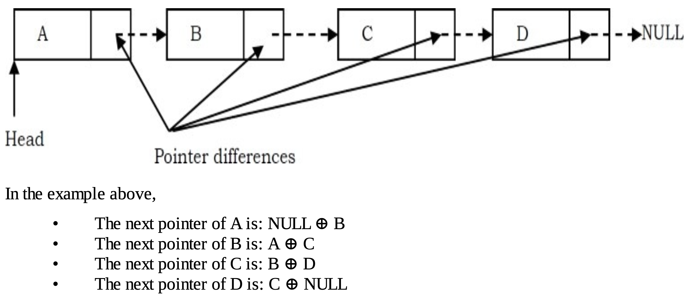

# A Memory-Efficient Doubly Linked List

This is an implementation of a doubly linked list using a memory-efficient approach.

# Why is it memory-efficient?

- In a conventional implementation, each node stores a pointer to the next item and a pointer to the previous item.
This means every node in a typical doubly linked list contains:
  - The data
  - A pointer to the next node
  - A pointer to the previous node
- In a memory-efficient implementation, we only store the XOR of the previous and next pointers, using the bitwise exclusive OR (⊕) operation.
With this approach, we can still traverse the list in both directions using just one pointer field per node.



# Why does it work?


# APIs

## Iterators:
| getForwardIterator | Get the forward iterator |
|---| --- |
| getBackwardIterator | Get the backward iterator |

## Modifiers:

| push_back | Insert element at the end of the list |
|---| --- |
| push_front | Insert element at the beginning of the list |
| pop_back | Remove element from the end of the list |
| pop_front | Remove element from the beginning of the list |
| insert | Insert an element at the specified index |
| remove | Remove an element at the specified index |

## Element access:
| get | Get the element at the specified index|
|---| --- |

## Capacity:
| getSize | Get the size of list |
|---| --- |
| isEmpty | Check wether list is empty or not | 

# How to traverse the list ?

I use iterator pattern to traverse elements of a collection without exposing its underlying representation

```c++
#include "memory-efficient-doubly-linkedlist.cpp"

int main(){
    MemoryEfficientLinkedList<int> list;
    list.push_back(1);
    list.push_back(2);
    list.push_back(3);
    MemoryEfficientLinkedList<int>::BaseIterator * it = list.getForwardIterator();
    while(it->hasNext()){
        cout<<it->getValue()<<" ";
        it->next();
    }
    return 0;
}
```
